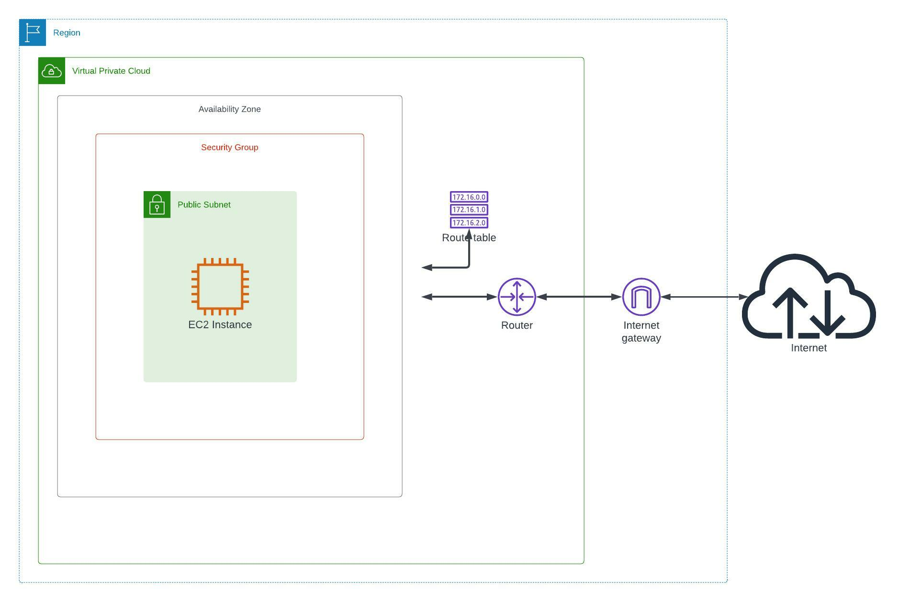

### AWS Simple Architecture build with Terraform

1. We will be using most common AWS architecture design given by [AWS Docs](https://docs.aws.amazon.com/vpc/latest/userguide/VPC_Scenario1.html), the docs are easy to understand but this project will try to implement it with Terraform. 

2. We will be using best practises of Terraform for IaC. 

3. The AWS Docs should be fair enough to start, but we will following some kind of process by breaking down all components into tasks and complete it in Agile or Iterations.

4. We will be writing user stories kind of for AWS Architecture. Something experimental, as more people discuss on architecture better it will get. 

5. Low key Goal of project is to Use Terraform and apply Software Development Process to provision infrastructure.